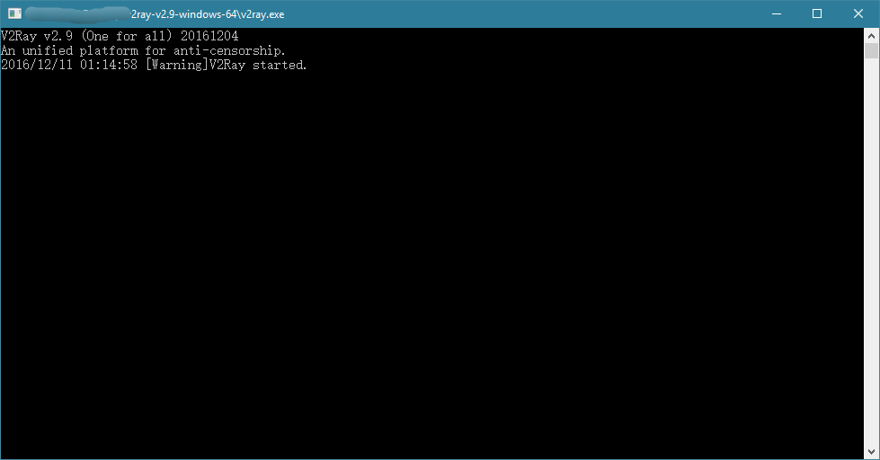
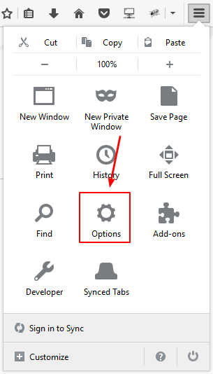
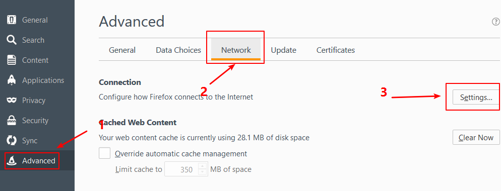
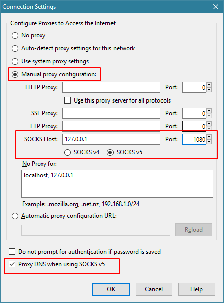

# 安装

本节将说明如何安装 V2Ray，内容包含服务器安装和客户端安装。需要注意的是，与 Shadowsocks 不同，V2Ray 不区分服务器版和客户端版，也就是说在服务器和客户端运行的 V2Ray 是同一个软件，区别只是配置文件的不同。因此 V2Ray 的安装在服务器和客户端上是一样的，但是大多数用户通常情况下 VPS 使用的是 Linux 而 PC 使用的是 Windows，因此本章默认服务器为 Linux VPS，客户端为 Windows PC。如果你的 PC 使用的是 Linux 操作系统，那么请参考服务器安装。如果你的 PC 使用的是 MacOS 或者 VPS 使用的是 Windows，两者请你自行研究怎么安装吧，安装完了跳过本节继续往下看。

-----

## 重要！！！

系统时间一定要正确。对于 V2Ray，它的验证方式包含时间，如果时间不正确，服务器会认为你这是不合法的请求。
只要互联网校准时间就好了，具体请 Google。

-----

## 客户端安装
点[这里](https://github.com/v2ray/v2ray-core/releases)下载 V2Ray 的 Windows 压缩包，如果是 32 位系统，下载 v2ray-windows-32.zip，如果是 64 位系统，下载 v2ray-windows-64.zip。解压之后会有 v2ray.exe 和 config.json 这两个文件，config.json 已经设置好 V2Ray 的官方服务器，也就是说你可以不自己搭建服务器而直接使用 V2Ray 提供的服务器科学上网。这个时候双击运行 v2ray.exe，这个时候可以通过 config.json 设置好的 VPS 科学上网。


但是现在还不能科学上网，因为 V2Ray 将所有选择权交给用户，它不会自动帮你设置系统代理，因此还需要在浏览器里设置代理。以火狐（Firefox）为例，点菜单 -> 选项 -> 高级 -> 设置 -> 手动代理设置，在 SOCKS Host 填上 127.0.0.1，后面的 Port 填 1080，再勾上使用 SOCKS v5 时代理 DNS (这个勾选项在旧的版本里叫做远程 DNS)。操作图见下：









## 服务器安装

在 Linux 操作系统， V2Ray 的安装有一键脚本安装、手动安装、编译安装 3 种方式，强烈推荐使用一键脚本安装，该脚本是 V2Ray 官方提供的。

### 使用一键安装脚本安装

V2Ray 官方提供了一个一键安装脚本，这个脚本适用于 Debian 系列，如果非 Debian 系统但带有 Systemd 也可使用。比如说，Centos 6.x 非 debian系也不带有 Systemd，因此在 Centos 6.x 不可使用官方提供的脚本安装 V2Ray。但是 Centos 7.x 内置有 Systemd 的所以可以使用脚本安装。

现在市面上绝大多数 linux 发行版的最新版本都内置了 Systemd，在支持 Systemd 的系统中，V2Ray 的安装脚本会添加一个 Systemd 的单元文件可以使得开机后自动运行软件，以及当 V2Ray 意外停止运行时自动启动 V2Ray（应该类似于 supervisord 托管服务），推荐用户使用带 Systemd 的系统。

本指南默认使用 Debian 8 系统，带 Systemd。

首先确保使用的是 root 账户，在 root 账户下安装 curl：
```
$ sudo apt-get install curl
```

如果是 Centos，则执行以下命令安装 curl:
```
$ sudo yum install curl
```

然后使用一键脚本安装 V2Ray:
```
$ sudo curl https://install.direct/go.sh | bash
% Total    % Received % Xferd  Average Speed   Time    Time     Time  Current
                               Dload  Upload   Total   Spent    Left  Speed
100  4915  100  4915  0     0    293      0  0:00:16  0:00:16 --:--:--   791
bash: line 88: /usr/bin/v2ray/v2ray: No such file or directory
Installing V2Ray v2.12.1 on x86_64
Downloading https://github.com/v2ray/v2ray-core/releases/download/v2.12.1/v2ray-linux-64.zip directly.
% Total    % Received % Xferd  Average Speed   Time    Time     Time  Current
                               Dload  Upload   Total   Spent    Left  Speed
100   595    0   595  0     0    446      0 --:--:--  0:00:01 --:--:--   447
100 2358k  100 2358k  0     0   270k      0  0:00:08  0:00:08 --:--:--  609k
Extracting V2Ray package to /tmp/v2ray.
Archive:  /tmp/v2ray/v2ray.zip
inflating: /tmp/v2ray/v2ray-v2.12.1-linux-64/systemd/v2ray.service
inflating: /tmp/v2ray/v2ray-v2.12.1-linux-64/systemv/v2ray
inflating: /tmp/v2ray/v2ray-v2.12.1-linux-64/v2ray
inflating: /tmp/v2ray/v2ray-v2.12.1-linux-64/vpoint_socks_vmess.json
inflating: /tmp/v2ray/v2ray-v2.12.1-linux-64/vpoint_vmess_freedom.json
PORT:36832
UUID:65d5fad7-af42-4ee9-b5df-a2d0998e8cd7
V2Ray v2.12.1 is installed.
```
看到类似于这样的输出算安装成功了，但是注意因为脚本没有检测命令出错的情况，有时候哪怕没有安装成功最后也会显示 V2Ray v2.X is installed，因此看到这句话不代表成功安装了，主要还是看安装的整个过程有没有错误提示。也可以执行 `systemctl status v2ray` 查看 V2Ray 的状态判断是否安装成功，当有类似下面的信息就代表安装成功了：
```
$ sudoo  systemctl status v2ray
● v2ray.service - V2Ray Service
   Loaded: loaded (/lib/systemd/system/v2ray.service; enabled)
   Active: inactive (dead)
```
在安装完 V2Ray 之后，修改配置文件重启 V2Ray 即可，配置文件路径为 /etc/v2ray/config.json。

对于 Systemd 系统，可以使用以下命令启动 V2Ray:
```
$sudo systemctl start v2ray
```

停止运行 V2Ray：
```
$ sudo  systemctl stop v2ray
```

重启 V2Ray:
```
$ sudo systemctl restart v2ray
```

在首次安装完成之后， V2Ray 不会自动启动，需要手动运行上述启动命令。而已经运行 V2Ray 的 VPS 上再次执行安装脚本，安装脚本会自动停止 V2Ray 进程，升级 V2Ray 程序，然后自动运行 V2Ray。在升级过程中，配置文件不会被修改。

### 手动安装
到[这里](https://github.com/v2ray/v2ray-core/releases)下载解压赋予执行权限运行（看不懂的话就用脚本安装吧，展开说太啰嗦了）

### 编译安装
请参考[这里](https://www.v2ray.com/chapter_04/04_compile.html)

-----

本小节讲了如何安装 V2Ray，如何配置请看后文。
